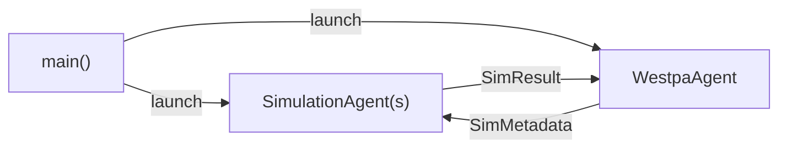

# Architecture

DeepDriveWE-Academy is built on the
[Academy](https://docs.academy-agents.org/stable/) multi-agent framework.
Simulations and resampling logic run as independent agents that
communicate asynchronously through typed messages.

## Agent Model

Every workflow has two agent types:



**SimulationAgent**
:   Runs a single MD simulation per invocation. Receives `SimMetadata`
    (walker weight, restart file, parent pcoord), runs the simulation in
    a thread pool via `agent_run_sync`, and sends the `SimResult` back
    to the WestpaAgent.

**WestpaAgent**
:   Orchestrates the iteration cycle. Buffers incoming `SimResult`
    objects until the full batch is collected, then runs
    user-defined inference (binning, recycling, resampling) and
    dispatches the next iteration of simulations round-robin.

## Communication Flow

1. `run_westpa_workflow` registers and launches all agents.
2. The initial batch of `SimMetadata` (from `ensemble.next_sims`) is
   dispatched round-robin to `SimulationAgent` instances.
3. Each `SimulationAgent` calls its `run_simulation` method, then
   sends the result to `WestpaAgent.receive_simulation_data`.
4. Once all results arrive, `WestpaAgent.run_westpa` fires:
    - Calls `run_inference` (user-defined resampling).
    - Advances ensemble state via `ensemble.advance_iteration`.
    - Checkpoints the ensemble.
    - Dispatches the next round of simulations.
5. Steps 3--4 repeat until `max_iterations` is reached.

## Academy Primitives

See the [Academy documentation](https://docs.academy-agents.org/stable/)
for more information.

| Primitive | Purpose |
|-----------|---------|
| [`Agent`](https://docs.academy-agents.org/stable/api/agent/#academy.agent.Agent) | Base class for all agents. Subclass to add state and methods. |
| [`@action`](https://docs.academy-agents.org/stable/api/agent/#academy.agent.action) | Marks an async method as remotely callable by other agents. |
| [`@loop`](https://docs.academy-agents.org/stable/api/agent/#academy.agent.loop) | Marks an async method as a background control loop. |
| [`Handle[T]`](https://docs.academy-agents.org/stable/api/handle/) | Typed proxy for calling actions on a remote agent of type `T`. |
| [`Manager`](https://docs.academy-agents.org/stable/api/manager/) | Orchestrates agent registration, launching, and shutdown. |
| [`LocalExchangeFactory`](https://docs.academy-agents.org/stable/api/exchange/local/) | In-process message transport (single machine). |
| [`HttpExchangeFactory`](https://docs.academy-agents.org/stable/api/exchange/cloud/) | Cloud message transport via the Academy Exchange (multi-node). |

## Execution Model

Simulations are CPU/GPU-bound and are offloaded to a
[Parsl](https://parsl-project.org/) executor. The WestpaAgent
runs on a CPU thread. The Academy `Manager` is initialized with named
executors:

```python
async with await Manager.from_exchange_factory(
    factory=LocalExchangeFactory(),
    executors={
        'gpu': ParslPoolExecutor(parsl_config),
        'cpu': ThreadPoolExecutor(max_workers=1),
    },
    default_executor='gpu',
) as manager:
    ...
```

Agents are assigned to executors at launch time:

```python
await manager.launch(OpenMMSimAgent, ..., executor='gpu')
await manager.launch(HuberKimWestpaAgent, ..., executor='cpu')
```

## Checkpointing

`EnsembleCheckpointer` saves the full ensemble state after each
iteration:

- **JSON checkpoints** -- one file per iteration
  (`checkpoint-000001.json`) containing the serialized
  `WeightedEnsemble`.
- **HDF5 log** -- a cumulative `west.h5` file in WESTPA-compatible
  format for analysis with standard WE tools.

Workflows automatically resume from the latest checkpoint when
restarted.

## Extending the Framework

To build a custom workflow:

1. **Subclass `SimulationAgent`** -- override `run_simulation` to run
   your simulation engine and compute progress coordinates.
2. **Subclass `WestpaAgent`** -- override `run_inference` to plug in
   your binning, recycling, and resampling strategy.
3. **Call `run_westpa_workflow`** -- pass your agent types, ensemble
   configuration, and compute settings.

See the [OpenMM NTL9 tutorial](../tutorials/openmm-ntl9-hk.md) for a
complete example.
