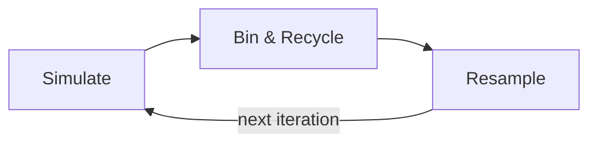

# Weighted Ensemble

Weighted ensemble (WE) is an enhanced sampling method for molecular
dynamics that accelerates the observation of rare events -- such as
protein folding or ligand binding -- without biasing the dynamics.

## How It Works

Instead of running a single long trajectory, WE maintains an **ensemble
of short simulations** (called *walkers*) that are periodically pruned
and replicated based on their progress toward a target state.

Each iteration of the WE algorithm proceeds in three stages:

### 1. Simulate

Each walker runs a short MD segment (e.g., 10 ps) starting from its
current restart file. At the end of the segment, a **progress
coordinate** (pcoord) is computed -- typically RMSD to a reference
structure -- that measures how close the walker is to the target state.

### 2. Bin and Recycle

Walkers are sorted into **bins** along the progress coordinate.
Walkers that reach the target state (e.g., RMSD < 1.0 A) are
**recycled**: their statistical weight is recorded and they are reset to
a basis (starting) state. This allows the ensemble to continuously
generate new transition events.

### 3. Resample

Within each bin, walkers are **split** (replicated) or **merged**
(combined) to maintain a target number of walkers per bin. Splitting
focuses computational effort on under-sampled regions of progress
coordinate space, while merging avoids wasting resources on
over-represented regions.

!!! important
    Resampling preserves the statistical weights of walkers so that
    ensemble averages remain unbiased. This is a key advantage of WE
    over other enhanced sampling methods.

## Key Concepts

**Walker**
:   A single simulation trajectory, characterized by its statistical
    weight, progress coordinate, and restart file.

**Progress Coordinate (pcoord)**
:   A low-dimensional measure of progress toward the target state.
    Common choices include RMSD, fraction of native contacts, or
    distance to a binding site.

**Bin**
:   A partition of progress coordinate space. Walkers within the same
    bin compete for computational resources during resampling.

**Basis State**
:   An initial (typically unfolded or unbound) configuration from which
    walkers start or are recycled to.

**Target State**
:   The desired end state (e.g., folded protein). Walkers that reach the
    target state are recycled.

## Algorithms in DeepDriveWE

DeepDriveWE provides several pluggable components:

| Component | Options |
|-----------|---------|
| **Binners** | [`RectilinearBinner`][deepdrivewe.binners.rectilinear.RectilinearBinner], [`MultiRectilinearBinner`][deepdrivewe.binners.multirectilinear.MultiRectilinearBinner] |
| **Recyclers** | [`LowRecycler`][deepdrivewe.recyclers.low.LowRecycler], [`HighRecycler`][deepdrivewe.recyclers.high.HighRecycler] |
| **Resamplers** | [`HuberKimResampler`][deepdrivewe.resamplers.huber_kim.HuberKimResampler], [`SplitLowResampler`][deepdrivewe.resamplers.low.SplitLowResampler], [`SplitHighResampler`][deepdrivewe.resamplers.high.SplitHighResampler], [`LOFLowResampler`][deepdrivewe.resamplers.lof.LOFLowResampler] |

The **Huber-Kim** resampler is the default and implements the algorithm
described in
[Huber & Kim (1996)](https://doi.org/10.1016/S0006-3495(96)79552-8),
which maintains a fixed number of walkers per bin by balancing split and
merge operations.

## Further Reading

- Zwier, M. C. *et al.* "WESTPA: An Interoperable, Highly Scalable
  Software Package for Weighted Ensemble Simulation and Analysis."
  [*J. Chem. Theory Comput.* **2015**, *11* (2),
  800--809](https://pubs.acs.org/doi/10.1021/ct5010615).
- Zuckerman, D. M. & Chong, L. T. "Weighted Ensemble Simulation:
  Review of Methodology, Applications, and Software."
  [*Annu. Rev. Biophys.* (2017)](https://www.annualreviews.org/content/journals/10.1146/annurev-biophys-070816-033834).
- Leung, J. M. G. *et al.* "Unsupervised Learning of Progress
  Coordinates during Weighted Ensemble Simulations: Application to
  NTL9 Protein Folding." [*J. Chem. Theory Comput.* **2025**, *21* (7),
  3691--3699](https://pubs.acs.org/doi/full/10.1021/acs.jctc.4c01136).
