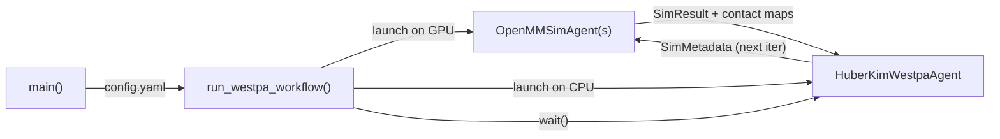

# Tutorial: OpenMM NTL9 Folding with Huber-Kim Resampling

This tutorial walks through a production weighted ensemble workflow that
folds the [NTL9](https://www.rcsb.org/structure/2HBB) protein (39
residues) using OpenMM molecular dynamics with Huber-Kim resampling.
Simulations are orchestrated as Academy agents and distributed across
GPUs via Parsl.

By the end you will understand how to:

- Configure a weighted ensemble experiment via YAML.
- Subclass `SimulationAgent` and `WestpaAgent` with custom logic.
- Launch a GPU-distributed workflow with `run_westpa_workflow`.
- Resume from checkpoints and extend runs.

## Prerequisites

Create a conda environment with OpenMM:

```bash
conda create -n deepdrivewe python=3.11 -y
conda activate deepdrivewe
conda install -c conda-forge openmm=8.1
pip install -e '.[dev]'
```

## File Structure

The example lives in `examples/openmm_ntl9_hk/`:

```
openmm_ntl9_hk/
├── main.py              # Entry point: parse args, build ensemble, launch agents
├── workflow.py          # Agent subclasses and Pydantic config models
├── config.yaml          # Experiment settings (edit this)
├── common_files/
│   └── reference.pdb    # Folded reference structure for RMSD calculation
└── inputs/
    └── bstates/
        └── ntl9.pdb     # Starting (unfolded) basis state structure
```

## Configuration

All experiment parameters live in a single YAML file. Here is the
default `config.yaml`:

```yaml
output_dir: results/
num_iterations: 100

basis_states:
  basis_state_dir: inputs/
  basis_state_ext: .pdb
  initial_ensemble_members: 4

basis_state_initializer:
  reference_file: common_files/reference.pdb
  mda_selection: protein and name CA

target_states:
  - label: folded
    pcoord: [1.0]

simulation_config:
  openmm_config:
    simulation_length_ns: 0.01    # 10 ps per iteration
    report_interval_ps: 2.0
    dt_ps: 0.002
    temperature_kelvin: 300.0
    solvent_type: implicit
  reference_file: common_files/reference.pdb

inference_config:
  sims_per_bin: 4

compute_config:
  name: workstation
  available_accelerators: ["0", "1", "2", "3"]
```

### Key Parameters

| Parameter | Default | Description |
|-----------|---------|-------------|
| `num_iterations` | 100 | Number of WE iterations to run |
| `simulation_config.openmm_config.simulation_length_ns` | 0.01 | MD segment length per iteration (ns) |
| `simulation_config.openmm_config.temperature_kelvin` | 300.0 | Simulation temperature (K) |
| `simulation_config.openmm_config.solvent_type` | implicit | Solvent model |
| `inference_config.sims_per_bin` | 4 | Target walker count per bin |
| `target_states[0].pcoord` | [1.0] | RMSD threshold for the folded state (A) |
| `compute_config.available_accelerators` | ["0","1","2","3"] | GPU device IDs for Parsl workers |

## How the Workflow Works

`run_westpa_workflow` launches two agent types that communicate
asynchronously:



### OpenMMSimAgent

Each `OpenMMSimAgent` receives a `SimMetadata` object, runs an OpenMM
simulation (implicit solvent, 10 ps), computes RMSD progress coordinates
and contact maps, and returns a `SimResult`:

```python
class OpenMMSimAgent(SimulationAgent):
    def __init__(
        self,
        westpa_handle: Handle[WestpaAgent],
        sim_config: SimulationConfig,
        output_dir: Path,
        logfile: Path | None = None,
    ) -> None:
        super().__init__(westpa_handle, logfile=logfile)
        self.sim_config = sim_config
        self.output_dir = output_dir

    def run_simulation(self, metadata: SimMetadata) -> SimResult:
        metadata.mark_simulation_start()

        # Set up output directory for this walker
        sim_output_dir = self.output_dir / metadata.simulation_name
        sim_output_dir.mkdir(parents=True, exist_ok=True)

        # Create and run the OpenMM simulation
        simulation = OpenMMSimulation(
            config=self.sim_config.openmm_config,
            top_file=self.sim_config.top_file,
            output_dir=sim_output_dir,
            checkpoint_file=metadata.parent_restart_file,
        )

        reporter = ContactMapRMSDReporter(
            report_interval=self.sim_config.openmm_config.report_steps,
            reference_file=self.sim_config.reference_file,
            cutoff_angstrom=self.sim_config.cutoff_angstrom,
            mda_selection=self.sim_config.mda_selection,
            openmm_selection=self.sim_config.openmm_selection,
        )

        simulation.run(reporters=[reporter])

        # Extract results
        contact_maps = reporter.get_contact_maps()
        pcoord = reporter.get_rmsds()

        metadata.restart_file = simulation.restart_file
        metadata.pcoord = pcoord.tolist()
        metadata.mark_simulation_end()

        return SimResult(
            data={'contact_maps': contact_maps, 'pcoord': pcoord},
            metadata=metadata,
        )
```

The base `SimulationAgent.simulate` action automatically:

1. Waits for the restart file to be visible (handles NFS caching).
2. Offloads `run_simulation` to a thread pool.
3. Sends the result to the WestpaAgent.

### HuberKimWestpaAgent

The `HuberKimWestpaAgent` collects results from all walkers and applies
a three-stage resampling pipeline:

```python
class HuberKimWestpaAgent(WestpaAgent):
    def run_inference(
        self,
        sim_results: list[SimResult],
    ) -> tuple[list[SimMetadata], list[SimMetadata], IterationMetadata]:
        cur_sims = [r.metadata for r in sim_results]

        # 1. Bin walkers along the RMSD progress coordinate
        binner = RectilinearBinner(
            bins=[0.0, 1.00, 1.10, 1.20, ...],
            bin_target_counts=self.inference_config.sims_per_bin,
            target_state_inds=0,
        )

        # 2. Recycle walkers that reach the target (RMSD < 1.0 A)
        recycler = LowRecycler(
            basis_states=self.basis_states,
            target_threshold=self.target_states[0].pcoord[0],
        )

        # 3. Resample: split under-represented, merge over-represented
        resampler = HuberKimResampler(
            sims_per_bin=self.inference_config.sims_per_bin,
        )

        return resampler.run(cur_sims, binner, recycler)
```

**Binning** -- Walkers are sorted into rectilinear bins along the RMSD
progress coordinate. Bins are finer near the target state (0.1 A
spacing) and coarser far away (0.6 A spacing).

**Recycling** -- Walkers that reach RMSD < 1.0 A are recycled: their
weight is recorded and they are reset to the unfolded basis state via
`LowRecycler`.

**Resampling** -- `HuberKimResampler` merges and splits walkers to
maintain the target count per bin (default: 4) while preserving
statistical weights.

## Running the Example

From the example directory:

```bash
cd examples/openmm_ntl9_hk
python main.py -c config.yaml
```

Or with the Academy Exchange Cloud (requires
[Globus](https://www.globus.org/) authentication):

```bash
python main.py -c config.yaml --exchange globus
```

!!! note
    If using the cloud exchange, run the authentication prior to
    submitting a batch job script. This caches a Globus auth session
    token on the machine that is reused by subsequent runs.

## What Happens at Startup

1. `ExperimentSettings.from_yaml` parses and validates `config.yaml`.
2. `EnsembleCheckpointer` checks for existing checkpoints.
   - If none exist, `WeightedEnsemble` is initialized from basis states
     with RMSD-based progress coordinates.
   - If a checkpoint exists, the ensemble is loaded and the workflow
     resumes from the last completed iteration.
3. A `ParslPoolExecutor` is created from the compute config to manage
   GPU workers.
4. `run_westpa_workflow` registers both agent types, launches them on
   the appropriate executors, dispatches the first iteration, and waits
   for completion.

## Output Structure

After running, the `results/` directory contains:

```
results/
├── params.yaml              # Copy of the experiment config
├── runtime.log              # Full runtime log
├── west.h5                  # WESTPA-compatible HDF5 file
├── checkpoints/
│   ├── checkpoint-000001.json
│   ├── checkpoint-000002.json
│   └── ...
├── simulation/
│   ├── 000001/              # Iteration 1
│   │   ├── 000000/          # Walker 0
│   │   ├── 000001/          # Walker 1
│   │   └── ...
│   └── ...
└── run-info/                # Parsl run metadata
```

## Resuming a Run

Simply re-run the same command. The checkpointer automatically detects
the latest checkpoint and resumes from that iteration:

```bash
python main.py -c config.yaml
```

To extend a completed run, increase `num_iterations` in `config.yaml`
and re-run.

## Stopping a Running Workflow

If running in the foreground, ++ctrl+c++ stops the workflow. If running
in the background:

```bash
kill <pid>
```

## Customization

### Custom Progress Coordinate

Subclass `SimulationAgent`, override `run_simulation`, and return
different values in `metadata.pcoord`. Replace the
`ContactMapRMSDReporter` with your own reporter.

### Different Resampling Strategy

Subclass `WestpaAgent`, override `run_inference`, and use a different
binner/recycler/resampler combination. Available options:

| Component | Options |
|-----------|---------|
| Binners | [`RectilinearBinner`][deepdrivewe.binners.rectilinear.RectilinearBinner], [`MultiRectilinearBinner`][deepdrivewe.binners.multirectilinear.MultiRectilinearBinner] |
| Recyclers | [`LowRecycler`][deepdrivewe.recyclers.low.LowRecycler], [`HighRecycler`][deepdrivewe.recyclers.high.HighRecycler] |
| Resamplers | [`HuberKimResampler`][deepdrivewe.resamplers.huber_kim.HuberKimResampler], [`SplitLowResampler`][deepdrivewe.resamplers.low.SplitLowResampler], [`SplitHighResampler`][deepdrivewe.resamplers.high.SplitHighResampler], [`LOFLowResampler`][deepdrivewe.resamplers.lof.LOFLowResampler] |

### HPC Clusters

Change the `compute_config` section in `config.yaml` to target your HPC
scheduler. See `deepdrivewe.parsl` for supported backends:

=== "Workstation (multi-GPU)"

    ```yaml
    compute_config:
      name: workstation
      available_accelerators: ["0", "1", "2", "3"]
    ```

=== "Slurm"

    ```yaml
    compute_config:
      name: vista
      available_accelerators: ["0", "1", "2"]
      # Additional Slurm-specific fields...
    ```

=== "Local (single CPU)"

    ```yaml
    compute_config:
      name: local
      max_workers_per_node: 1
    ```
