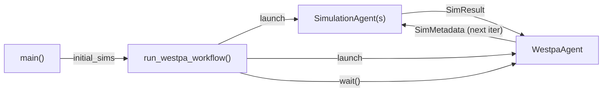

## Quick Start

A minimal example of the WESTPA (weighted ensemble) pattern using the `deepdrivewe.workflows` module. Only the simulation and inference stages -- no ML training.

Users provide two functions and `run_westpa_workflow` handles all agent orchestration:

- `mock_simulate` -- runs a single simulation walker (replace with real MD)
- `mock_inference` -- resamples the ensemble for the next iteration

Run the example locally (no authentication required):
```bash
pip install academy-py
python main.py
```

Or run via the Academy Exchange Cloud (requires Globus authentication):
```bash
python main.py --exchange globus
```

> **Note:** If using the cloud exchange, run the authentication prior to submitting a batch job script. This will cache a Globus auth session token on the machine that will be reused.

The `run_westpa_workflow` helper launches two agent types that communicate asynchronously via `SimResult` and `SimMetadata` objects:



**SimulationAgent** receives `SimMetadata`, calls the user's `simulate_fn` (offloaded to a thread pool), and sends the `SimResult` to the WestpaAgent.

**WestpaAgent** collects `SimResult`s from all simulations in a batch. Once the full batch is received, it calls the user's `inference_fn`, optionally advances the `WeightedEnsemble` state and saves a checkpoint, then dispatches the next iteration. Simulations are distributed round-robin across agents.

### Extending to real WESTPA

Replace the mock functions with real simulation and inference logic, using `functools.partial` to bind application-specific config:

```python
from functools import partial

from deepdrivewe.workflows.westpa import run_westpa_workflow

# Bind config to your simulation function
simulate = partial(run_simulation, config=sim_cfg, output_dir=out)

# Bind binner/recycler/resampler config to inference
infer = partial(
    run_inference,
    basis_states=ensemble.basis_states,
    target_states=ensemble.target_states,
    config=inference_cfg,
)

await run_westpa_workflow(
    manager=manager,
    simulate_fn=simulate,
    inference_fn=infer,
    initial_sims=ensemble.next_sims,
    max_iterations=100,
    ensemble=ensemble,
    checkpointer=checkpointer,
)
```

See the `openmm_ntl9_hk` example for a full implementation with OpenMM molecular dynamics.
