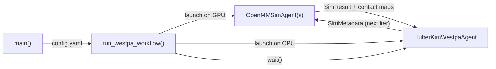

## OpenMM NTL9 Folding with Huber-Kim Weighted Ensemble

A production-ready example that folds the [NTL9](https://www.rcsb.org/structure/2HBA) protein (39 residues) using OpenMM molecular dynamics with Huber-Kim resampling in a weighted ensemble framework. Simulations are orchestrated as Academy agents and distributed across GPUs via Parsl.

### Prerequisites

Full conda environment with MD dependencies:
```bash
conda create -n deepdrivewe python=3.11 -y
conda activate deepdrivewe
conda install -c conda-forge openmm=8.1
pip install -e '.[dev]'
```

### Quick Start

From the example directory:
```bash
cd examples/openmm_ntl9_hk
python main.py -c config.yaml
```

Or run via the Academy Exchange Cloud (requires Globus authentication):
```bash
python main.py -c config.yaml --exchange globus
```

> **Note:** If using the cloud exchange, run the authentication prior to submitting a batch job script. This will cache a Globus auth session token on the machine that will be reused.

### How It Works

`run_westpa_workflow` launches two agent types that communicate asynchronously via `SimResult` and `SimMetadata` objects:



**OpenMMSimAgent** receives `SimMetadata`, runs an OpenMM MD simulation (implicit solvent, 10 ps per iteration), computes RMSD progress coordinates and contact maps, and sends the `SimResult` back to the WestpaAgent. Each simulation is offloaded to a GPU worker via Parsl.

**HuberKimWestpaAgent** collects results from all walkers in the current iteration, then applies the Huber-Kim resampling pipeline:
1. **Binning** -- walkers are sorted into rectilinear bins along the RMSD progress coordinate
2. **Recycling** -- walkers that reach the target state (RMSD < 1.0 A) are recycled to a basis state via `LowRecycler`
3. **Resampling** -- `HuberKimResampler` merges and splits walkers to maintain the target count per bin while preserving statistical weights

The ensemble state is checkpointed after each iteration, so runs can be resumed from the latest checkpoint.

### File Structure

```
openmm_ntl9_hk/
├── main.py              # Entry point: parses args, builds ensemble, launches agents
├── workflow.py           # Agent subclasses and Pydantic config models
├── config.yaml           # Experiment settings (edit this)
├── common_files/
│   └── reference.pdb     # Folded reference structure for RMSD calculation
└── inputs/
    └── bstates/
        └── ntl9.pdb      # Starting (unfolded) basis state structure
```

### Configuration

All settings live in `config.yaml`. Key parameters:

| Parameter | Default | Description |
|---|---|---|
| `num_iterations` | 100 | Number of WE iterations |
| `simulation_config.openmm_config.simulation_length_ns` | 0.01 | MD segment length per iteration (ns) |
| `simulation_config.openmm_config.temperature_kelvin` | 300.0 | Simulation temperature |
| `simulation_config.openmm_config.solvent_type` | implicit | Solvent model |
| `inference_config.sims_per_bin` | 4 | Walker count target per bin |
| `target_states[0].pcoord` | [1.0] | RMSD threshold for the folded state (A) |
| `compute_config.available_accelerators` | ["1","2","3"] | GPU device IDs for Parsl workers (analogous to `CUDA_VISIBLE_DEVICES=1,2,3`) |

### Stopping a Running Workflow

If running in the foreground, Ctrl+C will stop the workflow. If running in the background (e.g., via `nohup`), stop it in two steps:

```bash
kill <pid>      # Shuts down Parsl workers gracefully
kill -9 <pid>   # Then force-kill the main process
```

### Extending This Example

**Custom progress coordinate** -- Subclass `SimulationAgent`, override `run_simulation`, and return different values in `metadata.pcoord`. Swap the `ContactMapRMSDReporter` for your own reporter.

**Different resampling** -- Subclass `WestpaAgent`, override `run_inference`, and use a different binner/recycler/resampler combination. See `deepdrivewe.resamplers` and `deepdrivewe.recyclers` for available options.

**HPC clusters** -- Change `compute_config` in `config.yaml` to target an HPC scheduler. See `deepdrivewe.parsl.ComputeConfigTypes` for supported backends (e.g., Slurm, PBS).
