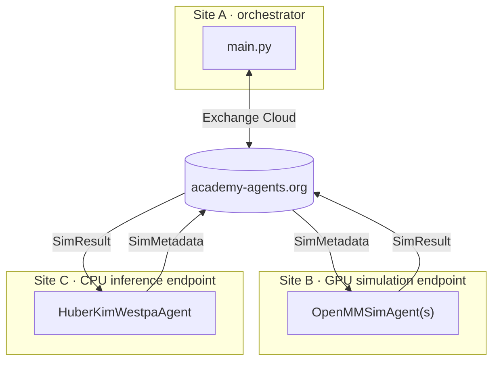

## Multi-site OpenMM NTL9 Folding with Huber-Kim Weighted Ensemble

This example supports three deployment modes:

1. **Single host** (`--exchange local`) — orchestrator, simulations,
   and inference all run on the same machine in thread pools. Good
   for smoke testing without any Globus infrastructure.
2. **Two sites** — orchestrator runs locally; simulations and
   inference run on a single remote HPC host via Globus Compute
   (set `inference_endpoint_id` to `null` to run the WESTPA agent
   locally on the orchestrator instead).
3. **Three sites** — orchestrator, GPU simulation endpoint, and CPU
   inference endpoint each run on separate machines.

The orchestrator and remote endpoints communicate through the
[Academy Exchange Cloud](https://docs.academy-agents.org/stable/)
via [Globus Compute](https://www.globus.org/compute) — no VPN or
shared filesystem required between sites.

### Architecture



The orchestrator (Site A) seeds the ensemble, writes `params.yaml`
and `runtime.log`, and drives the Academy Manager. `OpenMMSimAgent`s
run on a **GPU simulation endpoint** (Site B), while the
`HuberKimWestpaAgent` runs on a **CPU inference endpoint** (Site C).
Each agent chdirs to its `base_dir` on startup so relative paths
(`output_dir`, reference files, checkpoints) resolve correctly on
that host. All data (`SimMetadata`, `SimResult`) travels through the
Academy Exchange Cloud — the orchestrator never opens simulation files directly.

> **Single-endpoint mode.** `inference_endpoint_id` is optional. If
> you omit it, the `HuberKimWestpaAgent` runs locally on the
> orchestrator in a `ThreadPoolExecutor` (same pattern as the
> single-site example) and only simulations go to the remote GPU
> endpoint. Useful when you don't want to provision a second
> endpoint or when the orchestrator host has cheap filesystem
> access to the checkpoint directory.

### Prerequisites

Tested on **Python 3.11**.

> **Important:** All three sites (orchestrator, simulation endpoint,
> inference endpoint) must run the **same Python version** (e.g.
> Python 3.11). Globus Compute uses `dill` to serialize tasks and
> results across sites; mismatched Python versions cause
> deserialization failures.

**All hosts:**
- Python 3.11 with this repository installed: `pip install -e '.[dev]'`
- `pip install globus-compute-sdk globus-compute-endpoint`
- A Globus account and completed Globus Auth flow or [Globus Compute client credentials](https://globus-compute.readthedocs.io/en/2.3.1/sdk.html#client-credentials-with-clients).

**HPC endpoint host (site B):**
- OpenMM + MDAnalysis + mdtraj. Conda or micromamba recommended:

  ```bash
  # conda
  conda install -c conda-forge openmm=8.1
  # or micromamba (drop-in; faster solver, smaller footprint)
  micromamba install -c conda-forge openmm=8.1
  ```

  See the top-level [README](../../README.md) for the full MD env.
- Two running Globus Compute endpoints — one for simulations (GPU)
  and one for inference (CPU). On a single workstation both endpoints
  live on the same host, share the filesystem, and share the same
  micromamba env; they just differ in their `engine` shape.

  ```bash
  # Simulation endpoint: GPU, one worker per GPU.
  globus-compute-endpoint configure deepdrivewe-sim
  # Edit ~/.globus_compute/deepdrivewe-sim/config.yaml (see below).
  globus-compute-endpoint start deepdrivewe-sim
  # -> UUID goes into globus_compute.simulation_endpoint_id

  # Inference endpoint: CPU, one worker for the WESTPA agent.
  globus-compute-endpoint configure deepdrivewe-inf
  # Edit ~/.globus_compute/deepdrivewe-inf/config.yaml (see below).
  globus-compute-endpoint start deepdrivewe-inf
  # -> UUID goes into globus_compute.inference_endpoint_id

  # List all endpoints and their UUIDs:
  globus-compute-endpoint list
  ```

  **Simulation endpoint (`deepdrivewe-sim`).** On a single NVIDIA
  workstation with 8 GPUs, a `LocalProvider` engine that pins one
  worker per GPU via `available_accelerators` works well. Replace
  the generated `~/.globus_compute/deepdrivewe-sim/config.yaml`
  with the template below, updating the `TODO` values for your
  machine and environment:

  ```yaml
  display_name: DeepDriveWE GPU workstation

  engine:
    type: GlobusComputeEngine

    # TODO: Set these values according to your GPU count.
    max_workers_per_node: 8
    available_accelerators: 8

    provider:
      type: LocalProvider
      init_blocks: 1
      min_blocks: 1
      max_blocks: 1

      # worker_init runs in each worker shell before the Python
      # process starts. Activate the micromamba env with OpenMM +
      # this repo, and put the example dir on PYTHONPATH so workers
      # can import workflow.py.
      #
      # MAMBA_EXE points at the micromamba *binary*; MAMBA_ROOT_PREFIX
      # points at the micromamba *data root* (where envs/ lives).
      # These are the defaults from `micromamba shell init`; adjust
      # if your install uses different locations.
      #
      # TODO: Update the EXAMPLE_DIR path for your HPC host.
      # TODO: Put in your specific logic to activate your virtual environment
      worker_init: |
        # The example directory on the HPC host
        EXAMPLE_DIR="/nfs/ml_lab/projects/ml_lab/abrace/projects/ddwe/src/deepdrivewe-academy/examples/openmm_ntl9_hk_multisite"

        # Activate the venv/micromamba/conda env
        export MAMBA_EXE="$HOME/bin/micromamba"
        export MAMBA_ROOT_PREFIX="$HOME/micromamba"
        eval "$("$MAMBA_EXE" shell hook --shell bash --root-prefix "$MAMBA_ROOT_PREFIX")"
        micromamba activate deepdrivewe-academy

        export PYTHONPATH="$EXAMPLE_DIR:$PYTHONPATH"
  ```

  Notes:
  - `available_accelerators: 8` is the canonical way to pin one
    worker per GPU on a multi-GPU host — Globus Compute sets
    `CUDA_VISIBLE_DEVICES` per worker for you, so OpenMM picks up
    exactly one GPU.
  - `init_blocks: 1` / `max_blocks: 1` keep a single Parsl block
    (one HTEX manager for the whole workstation).
  - The env activated by `worker_init` must contain OpenMM 8.1, this
    repository (`pip install -e .`), and `globus-compute-sdk`.
  - If you prefer conda, swap the micromamba block for
    `source "$HOME/miniconda3/etc/profile.d/conda.sh" &&
    conda activate deepdrivewe-academy`.

  **Inference endpoint (`deepdrivewe-inf`).** The WESTPA agent is
  single-threaded and CPU-bound (binning, resampling, checkpointing),
  so one worker is enough. Replace
  `~/.globus_compute/deepdrivewe-inf/config.yaml` with the template
  below, updating the `TODO` values for your machine and environment:

  ```yaml
  display_name: DeepDriveWE inference (CPU)

  engine:
    type: GlobusComputeEngine
    max_workers_per_node: 1
    # No GPU pinning -- this endpoint runs the resampler, not MD.

    provider:
      type: LocalProvider
      init_blocks: 1
      min_blocks: 1
      max_blocks: 1

      # Same env + PYTHONPATH setup as the simulation endpoint so the
      # worker can import workflow.py.
      #
      # TODO: Update the EXAMPLE_DIR path for your host.
      # TODO: Put in your specific logic to activate your virtual environment.
      worker_init: |
        EXAMPLE_DIR="/rbstor/abrace/projects/ddwe/src/deepdrivewe-academy/examples/openmm_ntl9_hk_multisite"

        . "/rbstor/abrace/anaconda3/etc/profile.d/conda.sh"
        conda activate deepdrivewe-academy
        export PYTHONPATH="$EXAMPLE_DIR:$PYTHONPATH"
  ```

### Quick Start

1. Start both Globus Compute endpoints on the HPC host and note the
   two UUIDs.
2. Pre-stage this example directory on the HPC host (e.g. clone the
   repo there). Paths inside `config.yaml` must resolve to the same
   files on both hosts (see **Path Handling** below).
3. Edit `config.yaml`:
   - `globus_compute.simulation_endpoint_id` — the sim endpoint UUID.
   - `globus_compute.inference_endpoint_id` — the inference endpoint
     UUID. Optional: omit (or leave commented) to run the WESTPA
     agent locally on the orchestrator instead of on a second
     endpoint.
   - `simulation_config.base_dir` / `inference_config.base_dir` —
     absolute paths to this example directory on each endpoint host.
4. Run the orchestrator locally:

   ```bash
   cd examples/openmm_ntl9_hk_multisite
   python main.py -c config.yaml --exchange globus
   ```

### Smoke Test (Single Host)

To validate the scaffold without provisioning a Globus Compute
endpoint, run in local mode. Simulation agents run in a local
`ThreadPoolExecutor` and all traffic stays in-process.

```bash
python main.py -c config.yaml --exchange local
```

Local mode does not require `globus-compute-sdk`.

### Path Handling

Because the orchestrator and the simulation agents can live on
different hosts with different filesystems, be deliberate about which
host resolves which path:

| Path | Resolved on | Notes |
|---|---|---|
| `output_dir` | all three hosts | Created on the orchestrator at load time (`params.yaml`, `runtime.log`). Passed to each agent and resolved relative to its `base_dir` after chdir for checkpoints and simulation output. |
| `simulation_config.base_dir` | simulation host | Absolute path to this example directory. The sim agent chdirs here on startup so relative paths resolve correctly. |
| `inference_config.base_dir` | inference host | Absolute path to this example directory. The WESTPA agent chdirs here on startup. Set to `null` for local / single-site runs. |
| `basis_states.basis_state_dir` | all hosts | Opened on the orchestrator for pcoord init AND on the sim host for iter-0 restart files. Must resolve to the same files on all hosts. |
| `basis_state_initializer.reference_file` | orchestrator | Used once at init to compute initial pcoords. |
| `simulation_config.reference_file` | simulation host | Opened by the sim agent. Not validated at load time — an invalid path will fail during the first iteration. |

Rules of thumb:

- Never let an absolute path resolved on one host leak to the other.
  `SimulationConfig` is pickled across hosts, so its Path fields are
  **not** `.resolve()`d at load time.
- `SimResult` / `SimMetadata` carry pcoords and contact maps through
  the exchange; restart files stay on the simulation host.
- If `inputs/` and `common_files/` are the bundled relative paths
  (the defaults), run the orchestrator from this directory and ensure
  the HPC endpoint worker's cwd is the same relative directory (or
  use absolute paths in the YAML).

### File Structure

```
openmm_ntl9_hk_multisite/
├── main.py            # Orchestrator entry point
├── workflow.py        # Agent subclasses + Pydantic config models
├── config.yaml        # Experiment + Globus Compute settings
├── common_files/
│   └── reference.pdb  # Folded reference for RMSD
└── inputs/
    └── bstates/
        └── ntl9.pdb   # Starting (unfolded) basis state
```

### Configuration Reference

| Parameter | Default | Description |
|---|---|---|
| `num_iterations` | 100 | Number of WE iterations |
| `output_dir` | `results/` | Outputs directory (resolved on each host relative to its `base_dir`) |
| `simulation_config.base_dir` | — | Absolute path to example dir on the simulation host |
| `inference_config.base_dir` | `null` | Absolute path to example dir on the inference host |
| `simulation_config.openmm_config.simulation_length_ns` | 0.01 | MD segment length per iteration (ns) |
| `simulation_config.openmm_config.temperature_kelvin` | 300.0 | Simulation temperature |
| `simulation_config.openmm_config.solvent_type` | implicit | Solvent model |
| `inference_config.sims_per_bin` | 4 | Walker count target per bin |
| `target_states[0].pcoord` | `[1.0]` | RMSD threshold for the folded state (Å) |
| `globus_compute.simulation_endpoint_id` | — | GPU endpoint UUID (OpenMM simulations) |
| `globus_compute.inference_endpoint_id` | `null` | CPU endpoint UUID (WESTPA resampler). Optional; when unset, the resampler runs locally on the orchestrator. |

### Stopping a Running Workflow

Ctrl+C on the orchestrator triggers shutdown. Both `GCExecutor`s are
closed in the `finally` block; agents on the endpoints terminate
when the exchange connection drops. To stop only the HPC side, stop
the Globus Compute endpoints
(`globus-compute-endpoint stop deepdrivewe-sim` and
`globus-compute-endpoint stop deepdrivewe-inf`).


---

> **Known limitation:** checkpoint resume in multi-site workflows is
> not yet fully supported. On resume the orchestrator dispatches fresh
> initial simulations from the seed ensemble, which may not match the
> checkpoint's `next_sims`. Full multi-site resume requires the
> inference agent to re-dispatch the correct walkers from the
> checkpoint state. Single-site (`--exchange local`) resume works as
> expected.
